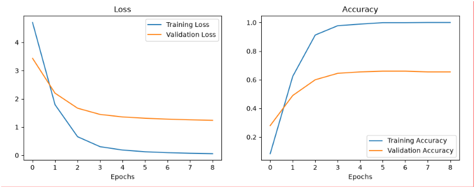
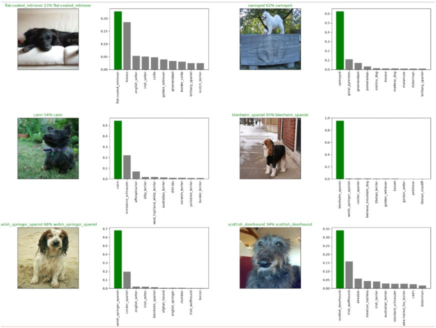

#  Dog Vision — Multi-class Dog Breed Classifier

An end-to-end deep learning project that identifies **120 dog breeds** from images using **Transfer Learning** with MobileNetV2 and TensorFlow 2.x.

---

##  Results

| Run | Training Set | Train Accuracy | Val Accuracy |
|---|---|---|---|
| Subset model | 1,000 images | ~100% | **66%** |
| Full model | ~10,000 images | ~99.6% | — (no val split) |

> The subset model shows classic overfitting — training accuracy hits 100% while validation plateaus at 66%. This is expected when only training the classification head on a small slice of data with a frozen backbone.

### Training Curves (1,000-image subset)


### Sample Predictions


---

##  Problem Statement

Given an image of a dog, classify it into one of **120 breeds** from the [Kaggle Dog Breed Identification](https://www.kaggle.com/c/dog-breed-identification) competition.

---

##  Model Architecture

```
Input Image (224×224×3)
        ↓
MobileNetV2 backbone (pretrained on ImageNet, frozen)
        ↓ (outputs 1001-dim vector)
Dense(120, activation='softmax')
        ↓
Breed probabilities
```

| Component | Detail |
|---|---|
| Base model | MobileNetV2 via TF Hub |
| Trainable params | 120,240 (classification head only) |
| Frozen params | 5,432,713 (MobileNetV2 backbone) |
| Loss | Categorical Crossentropy |
| Optimizer | Adam |
| Callbacks | EarlyStopping (patience=3), ModelCheckpoint, TensorBoard |

---

##  Dataset

- Source: [Kaggle Dog Breed Identification](https://www.kaggle.com/c/dog-breed-identification/data)
- ~10,000 labeled training images across 120 breeds
- ~10,000 unlabeled test images

> **Note:** Dataset not included. Download from Kaggle and place in `dog-breed-identification/`.

```
dog-breed-identification/
├── train/       ← labeled .jpg images
├── test/        ← unlabeled .jpg images
└── labels.csv   ← image IDs + breed labels
```

---

##  Setup

```bash
# 1. Clone
git clone https://github.com/<your-username>/Dog-vision_project.git
cd Dog-vision_project

# 2. Create environment (Python 3.11 recommended — TF doesn't support 3.13 yet)
conda create -n tf-env python=3.11
conda activate tf-env

# 3. Install dependencies
pip install -r requirements.txt

# 4. Launch notebook
jupyter notebook dog-vision.ipynb
```

---

## 📁 Project Structure

```
Dog-vision_project/
├── dog-vision.ipynb          ← Main notebook (EDA → model → predictions)
├── labels.csv                ← Breed labels from Kaggle
├── requirements.txt
├── assets/                   ← Screenshots for README
│   ├── training_curves.png
│   └── sample_predictions.png
├── models/                   ← Saved .h5 files (git-ignored)
├── logs/                     ← TensorBoard logs (git-ignored)
└── README.md
```

---

##  Tech Stack


- **TensorFlow 2.18** + **tf_keras** (Keras 2 compatibility layer)
- **TensorFlow Hub** — MobileNetV2 pretrained weights
- **NumPy / Pandas** — data handling
- **Matplotlib** — visualizations
- **scikit-learn** — label encoding

---

##  Key Concepts Demonstrated

- **Transfer Learning** — reusing ImageNet-pretrained MobileNetV2 features
- **Data Pipelines** — `tf.data` batching and preprocessing
- **One-hot Encoding** — for 120-class labels
- **Callbacks** — EarlyStopping, ModelCheckpoint, TensorBoard
- **Prediction Visualization** — showing confidence scores per breed


---

## 🙏 Acknowledgements

- [Kaggle Dog Breed Identification](https://www.kaggle.com/c/dog-breed-identification)
- [ZeroToMastery TensorFlow course](https://zerotomastery.io/)
- [MobileNetV2 paper](https://arxiv.org/abs/1801.04381)
